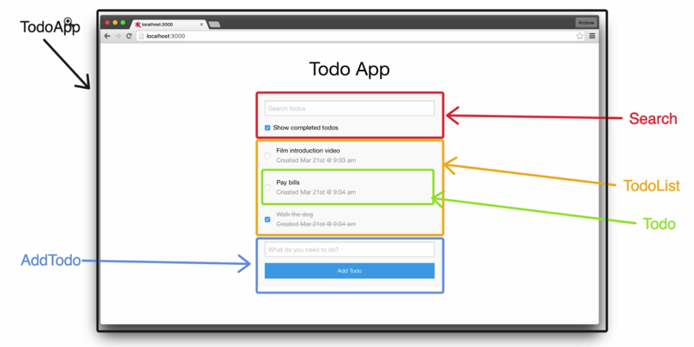

# React Todo
A simple Todo app written in ReactJS

## The App


## Getting Started
### Install dependencies
```bash
npm install
```

### Start
```bash
npm start
```

### Run tests
```bash
npm test
```

## Heroku

* [Pushing your app to Heroku](https://devcenter.heroku.com/articles/git)

### Create
```bash
heroku create
```

### Verify remote was added
```bash
git remote -v
```

### Push to Heroku
```bash
git push heroku master
```